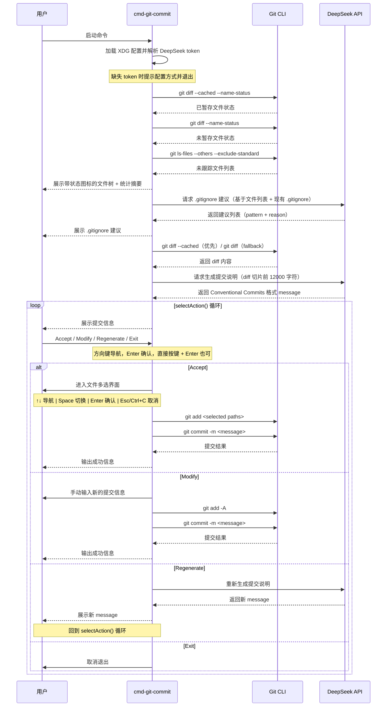

# Git 提交辅助执行流程

## 整体流程

```
printFileTree()                    → 展示所有变更文件（已暂存 + 未暂存 + 未跟踪）
    ↓
suggestGitignore()                 → AI 建议 .gitignore 规则
    ↓
getDiff()                          → 优先取 git diff --cached，fallback 到 git diff
    ↓
generateMessage()                  → AI 生成 Conventional Commits 格式的中文提交信息
    ↓
selectAction() 循环                → 用户选择 Accept / Modify / Regenerate / Exit
    │
    ├── Accept → selectFiles()     → 交互式文件多选 → git add <selected> → git commit
    ├── Modify → input()           → 用户手动编辑 → git add -A → git commit
    ├── Regenerate → generateMessage()  → 重新生成 → 回到 selectAction()
    └── Exit → process.exit(0)
```

## 详细执行序列



## 步骤说明

| 步骤 | 动作 | 输入 | 输出 | 备注 |
|------|------|------|------|------|
| 1 | 加载配置 | 环境变量 / config.json | token + modelName | token 缺失时退出；modelName 从 `deepseek.model` 读取，默认 `deepseek-chat`。配置路径：`$XDG_CONFIG_HOME/cmd4bun/config.json`，回退 `~/.config/cmd4bun/config.json` |
| 2 | 收集文件变更 | Git 工作区 | `{path, status}[]` | 覆盖 staged（status=A/M/D/R/C）、unstaged（status=M/D）、untracked（status=?）。已暂存优先于未暂存，避免重复记录 |
| 3 | 构建并打印文件树 | 文件列表 | 控制台输出 | 目录优先于文件排序，文件夹以 `/` 结尾加粗显示。含状态统计摘要行 |
| 4 | 请求 .gitignore 建议 | 文件列表 + 现有 `.gitignore` | `{pattern, reason}[]` | AI 仅分析变更文件。已在 `.gitignore` 中的模式不再重复建议。输出为空时不展示。失败静默返回空数组 |
| 5 | 获取 diff | Git 仓库 | diff 文本 | 优先 `git diff --cached`（已暂存 diff），fallback 到 `git diff`（未暂存 diff）。无 diff 但有新增文件（如纯 untracked 场景）时传入空字符串 |
| 6 | 生成提交说明 | diff 文本（前 12000 字符） | commit message 字符串 | 模型从配置 `deepseek.model` 读取，默认 `deepseek-chat`；max_tokens：1024。遵循 Conventional Commits 格式。生成失败或非 text 响应时返回空字符串 |
| 7 | selectAction() 循环 | 当前 message | action key（a/m/r/x） | 展示 message，用户通过方向键或快捷键选择，Enter 确认 |
| 8 | Accept -> selectFiles() | 文件变更列表 | 选中文件路径列表 | 交互式多选界面。已暂存文件[●]不可取消。Esc/Ctrl+C 回到 selectAction() 循环 |
| 9 | git add | 选中文件路径 | 无（副作用） | `git add -- <paths>`。特殊字符路径通过 JSON.stringify 转义。执行前清理 `.git/index.lock` |
| 10 | git commit | message | 提交结果 | `git commit -m <message>`，通过 execFileSync 隔离参数传递，避免 shell 注入 |
| 11 | Modify -> git add -A | 无 | 无（副作用） | 用户手动修改 message 后，使用 `git add -A` 暂存所有变更后提交 |

## 异常处理

| 异常场景 | 处理方式 | 影响范围 |
|---------|---------|---------|
| DeepSeek token 缺失 | 输出环境变量和配置文件设置方式后退出 | 流程终止 |
| 当前仓库无变更 | 输出 "No changes to commit" 并退出 | 不创建提交 |
| AI 生成失败或输出不可解析 | 返回空建议或空提交信息 | 影响本次交互质量 |
| 用户按 Ctrl+C 或 Esc | 随时退出流程 | 不创建提交 |
| selectFiles() 中 Esc/Ctrl+C | 返回空数组，回到 selectAction() 循环 | 流程回退，不提交 |
| GitHub Copilot 快键冲突（Ctrl+I） | Ctrl+Space 可替代逗号键输入 | 仅影响 Space 切换 |
| 用户 Accept 后未选择任何文件 | 输出 "No files selected, going back" 后回到循环 | 流程回退，不提交 |
| git add 失败 | 输出错误信息并退出 | 本次提交失败 |
| git commit 失败 | git 输出错误到 stderr | 本次提交失败 |

## 状态流转

```text
HAS_CHANGES → GENERATED → CONFIRMING → COMMITTED
              ↘ REGENERATED ───┘
              ↘ MODIFIED ──────┘
              ↘ CANCELLED
NO_CHANGES → EXITED
```

- `NO_CHANGES`：当前仓库无变更时直接结束。
- `GENERATED`：AI 已生成提交说明，但尚未获得用户确认。
- `REGENERATED` / `MODIFIED`：用户要求重生成或手动修改后，回到确认循环。
- `COMMITTED`：用户确认后完成暂存和提交。

## 关键影响点

- **`loadConfig` / `resolveToken`**：影响 DeepSeek API token 来源和缺失时的提示信息。
- **`getFileChanges`**：影响变更摘要展示和 `.gitignore` 建议输入范围。
- **`getDiff`**：影响 AI 生成提交说明所依据的 diff。优先 staged diff。
- **`generateMessage`**：影响提交说明生成质量和模型调用参数。diff 超过 12000 字符时截断。
- **`selectAction`**：影响用户确认、修改、重生成和取消提交的交互路径。
- **`selectFiles`**：影响提交前文件选择的精确性。已暂存文件不可取消。
- **`execFileSync("git", ["commit", "-m", message])`**：影响最终提交动作和命令参数安全性。
- **`git add -A` 回退**：仅 Modify 路径使用全量暂存；Accept 路径改为精确文件选择。
